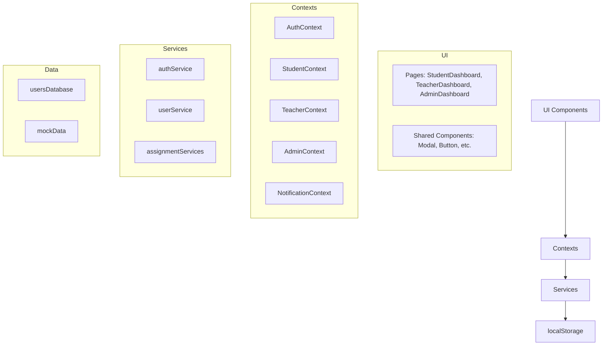

## Учебный портал контроля работ колледжа

Одностраничное web‑приложение для управления учебными заданиями в колледже с поддержкой ролей **студент / преподаватель / администратор**, личных кабинетов, регистрации и авторизации. Проект выполнен на **React + React Router + SCSS** и хранит данные в браузере (эмуляция БД через `localStorage`).

Основная идея приложения — показать полный цикл работы с учебными заданиями в электронном виде: от выдачи и сдачи работ до проверки, оценки и администрирования учебного процесса. Проект ориентирован на демонстрацию архитектуры клиентского SPA и организации кода в небольшом, но функциональном учебном продукте.

### Цели и задачи проекта

- **Автоматизировать контроль выполнения работ**: дать студенту удобный список заданий со статусами, а преподавателю — централизованный список сдач.
- **Продемонстрировать разделение доступа по ролям**: каждый пользователь видит только свой дашборд и свои действия.
- **Показать работу с состоянием в React**: контексты, mock‑“БД”, сервисы, локальное хранилище.
- **Создать понятный и современный интерфейс**: единый визуальный стиль, адаптивная верстка, удобные формы.

### Основной функционал

- **Аутентификация и регистрация**
  - Вход по логину или email + пароль.
  - Регистрация новых пользователей (студентов). Преподавателей добавляет администратор.
  - Хеширование паролей с помощью `bcryptjs` (в хранилище пароль не хранится в открытом виде).
  - Валидация всех форм с проверкой на пробелы, формат данных, длину полей.

- **Роли и личные кабинеты**
  - **Студент**
    - Просмотр списка заданий по предметам (видны только релевантные задания по группе и преподавателю).
    - Фильтрация и поиск, сортировка по срокам, статусу, курсу.
    - Сдача работ (загрузка файла) с валидацией размера и формата.
    - Просмотр результатов и комментариев преподавателя.
  - **Преподаватель**
    - Создание и управление заданиями для студентов.
    - Просмотр списка заданий и всех сдач по ним.
    - Оценивание работ, выставление баллов, возврат на доработку с комментарием.
    - Валидация загружаемых файлов (размер, формат, имя файла).
    - Базовая аналитика по заданиям и успеваемости.
  - **Администратор**
    - Управление пользователями (создание, редактирование, удаление).
    - Управление курсами (создание, редактирование, удаление).
    - Управление заданиями (просмотр всех заданий, удаление).
    - Настройки системы (общие настройки, уведомления, резервное копирование, обслуживание).
    - Просмотр статистики и системных логов (входы, действия администратора и т.п.).
  - **Профиль (общий для всех ролей)**
    - Редактирование основных данных пользователя (ФИО, логин, email, группа/кафедра, телефон, часовой пояс, «о себе»).
    - Смена пароля с проверкой текущего пароля.

- **UI и UX**
  - Общая шапка и подвал, навигация по разделам.
  - Набор UI‑компонентов: `Button`, `Card`, `Input`, `Select`, `Modal`, `Toast`, `Table`, `Badge`, `TextArea` и др.
  - Система уведомлений (toast) для отображения ошибок и успешных действий.
  - Комплексная валидация всех форм:
    - Проверка формата email, телефона, логина.
    - Валидация паролей (длина, сложность, совпадение).
    - Проверка размеров и форматов загружаемых файлов.
    - Автоматическая обрезка пробелов по краям полей ввода.
    - Проверка дедлайнов, оценок, обязательных полей.
  - Адаптивная верстка основных экранов.

### Обзор основных страниц

- **Welcome** — приветственный экран с кратким описанием системы, переходами к входу и регистрации.
- **Login** — форма входа по логину/email и паролю, с валидацией и отображением ошибок.
- **Register** — регистрация нового студента:
  - дополнительные поля (выбор группы из существующих или создание новой);
  - строгая валидация пароля (длина, регистр, цифры).
- **StudentDashboard** — рабочий стол студента:
  - блок статистики (всего заданий, срочные, ожидают сдачи, выполнено);
  - список заданий в виде карточек;
  - фильтры по статусу и срочности, поиск, сортировка.
- **TeacherDashboard** — рабочий стол преподавателя:
  - список заданий;
  - таблица всех сдач с фильтрами;
  - модальные окна оценки и возврата с комментариями.
- **AdminDashboard** — административный раздел:
  - обзорная панель со статистикой системы;
  - управление пользователями (создание, редактирование, удаление, назначение преподавателей студентам);
  - управление курсами (создание, редактирование, удаление);
  - управление заданиями (просмотр всех заданий системы, удаление);
  - настройки системы (общие параметры, уведомления, резервное копирование, обслуживание);
  - системные логи (входы, действия администратора и т.п.).
- **Profile** — личный кабинет:
  - общие данные профиля;
  - блок смены пароля.

### Технологии

- **Фронтенд**
  - `React` (create‑react‑app, функциональные компоненты и hooks).
  - `react-router-dom` — маршрутизация и защита роутов по ролям.
  - Контексты (`AuthContext`, `StudentContext`, `TeacherContext`, `AdminContext`, `NotificationContext`) через `RootProvider`.
  - SCSS‑модули, общие переменные и миксины (`src/styles`).

- **Данные и сервисы**
  - `localStorage` как простая “БД”:
    - `src/data/usersDatabase.js` — слой работы с пользователями и текущим пользователем.
    - `src/services/userService.js` — сервис доступа к “БД” пользователей.
    - `src/services/authService.js` — регистрация, вход, смена пароля, обновление профиля, получение пользователей.
  - Mock‑данные для заданий, сдач, курсов и логов (`src/data/mockData`).

### Структура проекта

- `public/`
  - `index.html` — корневой HTML‑шаблон приложения.
- `src/`
  - `index.js` — входная точка React‑приложения.
  - `App.js` — роутинг и общая компоновка приложения.
  - `pages/` — страницы (Welcome, Login, Register, StudentDashboard, TeacherDashboard, AdminDashboard, Profile).
  - `components/` — переиспользуемые компоненты (Layout, UI, блоки для ролей).
  - `context/` — контексты для авторизации, ролей, уведомлений.
  - `services/` — работа с пользователями и “БД”.
  - `data/` — исходные mock‑данные.
  - `styles/` — глобальные стили, базовые переменные и миксины.
  - `utils/` — утилиты и валидация форм (валидация логина/регистрации, заданий, профиля, паролей, оценок и др.).

### Архитектура и поток данных



- **Контексты**
  - `AuthContext` — текущее состояние авторизации, вход/выход, регистрация, обновление профиля и смена пароля.
  - `StudentContext`, `TeacherContext`, `AdminContext` — данные и операции, специфичные для каждой роли (задания, сдачи, статистика, пользователи, курсы).
  - `NotificationContext` — централизованные toast‑уведомления.
- **Провайдеры**
  - `RootProvider` объединяет все контексты и в зависимости от роли пользователя подключает нужный провайдер (`StudentProvider`, `TeacherProvider`, `AdminProvider`).
- **Сервисы и “БД”**
  - `usersDatabase` ⇄ `userService` ⇄ `authService` ⇄ `AuthContext` ⇄ компоненты страниц.
  - Mock‑данные заданий и сдач (`mockData`) читаются и дополняются состоянием из `localStorage`.

Такое разделение позволяет изолировать работу с данными от UI и легко заменить `localStorage` на реальный backend‑API.

### Запуск проекта локально

Требования: установленный **Node.js** (рекомендуется LTS) и **npm**.

```bash
git clone <репозиторий>
cd college-works-control
npm install
npm start
```

Приложение будет доступно по адресу `http://localhost:3000/`.

### Сценарии использования

- **Для студента**
  1. Войти под тестовым студентом или зарегистрировать нового.
  2. На дашборде отфильтровать задания по статусу / срочности, найти нужный предмет.
  3. Открыть карточку задания, сдать работу через модалку (загрузить файл).
  4. После проверки — посмотреть оценку и комментарий преподавателя.

- **Для преподавателя**
  1. Войти под преподом.
  2. На дашборде посмотреть список своих заданий, открыть таблицу сдач.
  3. Для каждой работы — выставить балл или вернуть на доработку с комментарием.

- **Для администратора**
  1. Войти под админом.
  2. На обзорной панели посмотреть статистику системы.
  3. В разделе "Пользователи" создать или отредактировать пользователей, назначить преподавателей студентам.
  4. В разделе "Курсы" управлять учебными дисциплинами.
  5. В разделе "Задания" просмотреть все задания системы и при необходимости удалить их.
  6. В разделе "Настройки" изменить параметры системы, настроить резервное копирование.
  7. Изучить системные логи для отслеживания активности.

### npm‑скрипты

- **`npm start`** — запускает dev‑сервер (`http://localhost:3000/`).
- **`npm run build`** — сборка оптимизированной продакшн‑версии приложения.

### Тестовые пользователи

В "БД" по умолчанию создаются несколько пользователей (пароль везде `Password123`):

- **Студент**  
  - Логин: `student_zabiryuchenko`  
  - Email: `zabiryuchenko@college.ru`
- **Преподаватель**  
  - Логин: `teacher_kartseva`  
  - Email: `kartseva@college.ru`
- **Администратор**  
  - Логин: `admin_sidorov`  
  - Email: `sidorov@college.ru`

Можно также зарегистрировать новых студентов через форму регистрации. Преподавателей добавляет администратор.

Этот проект задуман как учебный пример системы контроля учебных работ и может служить основой для дальнейшего развития до полнофункционального портала колледжа.
