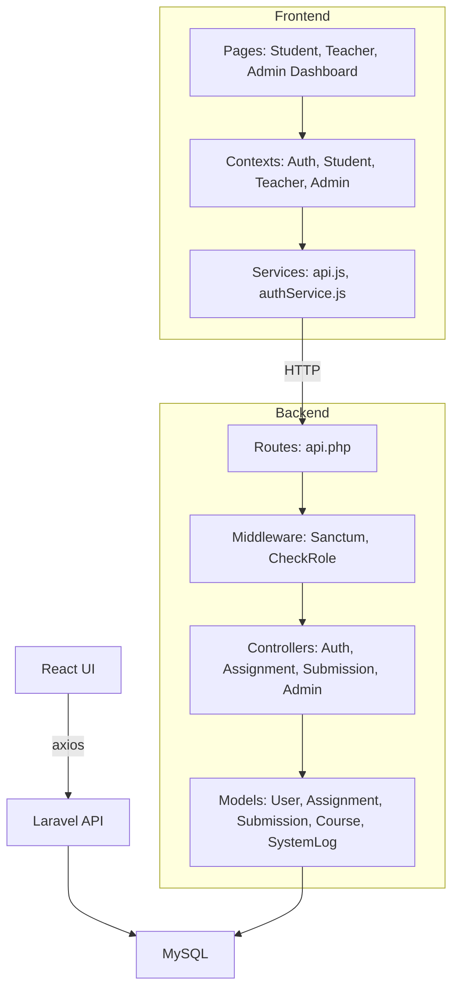

## Учебный портал контроля работ колледжа

Полнофункциональное веб-приложение для управления учебными заданиями в колледже с поддержкой ролей **студент / преподаватель / администратор**, личных кабинетов, регистрации и авторизации.

**Фронтенд** — React (SPA), **бэкенд** — Laravel (REST API), **база данных** — MySQL. Аутентификация реализована через Laravel Sanctum (token-based).

Основная идея приложения — показать полный цикл работы с учебными заданиями в электронном виде: от выдачи и сдачи работ до проверки, оценки и администрирования учебного процесса.

### Цели и задачи проекта

- **Автоматизировать контроль выполнения работ**: дать студенту удобный список заданий со статусами, а преподавателю — централизованный список сдач.
- **Продемонстрировать разделение доступа по ролям**: каждый пользователь видит только свой дашборд и свои действия.
- **Реализовать клиент-серверную архитектуру**: React-фронтенд взаимодействует с Laravel API через HTTP-запросы.
- **Создать понятный и современный интерфейс**: единый визуальный стиль, адаптивная верстка, удобные формы.

### Основной функционал

- **Аутентификация и регистрация**
  - Вход по логину или email + пароль.
  - Регистрация новых пользователей (студентов). Преподавателей добавляет администратор.
  - Хеширование паролей на сервере (bcrypt через Laravel).
  - Token-based аутентификация (Laravel Sanctum).
  - Валидация всех форм с проверкой формата данных, длины полей.

- **Роли и личные кабинеты**
  - **Студент**
    - Просмотр списка заданий по предметам (видны только релевантные задания по группе и преподавателю).
    - Фильтрация и поиск, сортировка по срокам, статусу, курсу.
    - Сдача работ (загрузка файла) с валидацией размера и формата.
    - Просмотр результатов и комментариев преподавателя.
  - **Преподаватель**
    - Создание и управление заданиями для студентов.
    - Критерии оценки с указанием баллов за каждый критерий.
    - Просмотр списка заданий и всех сдач по ним.
    - Оценивание работ, выставление баллов, возврат на доработку с комментарием.
    - Базовая аналитика по заданиям и успеваемости.
  - **Администратор**
    - Управление пользователями (создание, редактирование, удаление).
    - Управление курсами (создание, редактирование, удаление).
    - Управление заданиями (просмотр всех заданий, удаление).
    - Просмотр статистики и системных логов.
  - **Профиль (общий для всех ролей)**
    - Редактирование данных пользователя (ФИО, email, телефон, часовой пояс, «о себе»).
    - Смена пароля с проверкой текущего пароля.

- **UI и UX**
  - Общая шапка и подвал, навигация по разделам.
  - Набор UI-компонентов: `Button`, `Card`, `Input`, `Select`, `Modal`, `Toast`, `Table`, `Badge`, `TextArea` и др.
  - Система уведомлений (toast) для отображения ошибок и успешных действий.
  - Комплексная валидация всех форм.
  - Адаптивная верстка основных экранов.

### Технологии

- **Фронтенд**
  - `React 19` (create-react-app, функциональные компоненты и hooks).
  - `react-router-dom 7` — маршрутизация и защита роутов по ролям.
  - `axios` — HTTP-клиент с автоматической конвертацией camelCase/snake_case.
  - Контексты (`AuthContext`, `StudentContext`, `TeacherContext`, `AdminContext`, `NotificationContext`) через `RootProvider`.
  - SCSS-модули, общие переменные и миксины.

- **Бэкенд**
  - `Laravel 12` (PHP 8.2+).
  - `Laravel Sanctum` — аутентификация по токенам.
  - `Eloquent ORM` — работа с базой данных.
  - Middleware для проверки ролей (`CheckRole`) и конвертации ключей (`ConvertCamelToSnake`).
  - REST API с разделением доступа по ролям.

- **База данных**
  - `MySQL` — хранение пользователей, заданий, сдач, курсов, системных логов.
  - Миграции и сидеры для воспроизводимой структуры и тестовых данных.

### Структура проекта

```
college-works-control/
├── frontend/                  # React-приложение
│   ├── public/
│   │   └── index.html
│   └── src/
│       ├── App.js             # Роутинг и общая компоновка
│       ├── pages/             # Страницы (Welcome, Login, Register, Dashboard'ы, Profile)
│       ├── components/        # Переиспользуемые компоненты (Layout, UI, блоки для ролей)
│       ├── context/           # Контексты для авторизации, ролей, уведомлений
│       ├── services/          # API-клиент и сервис аутентификации
│       ├── styles/            # Глобальные стили, переменные, миксины
│       └── utils/             # Утилиты и валидация форм
│
└── backend/                   # Laravel API
    ├── app/
    │   ├── Http/
    │   │   ├── Controllers/   # AuthController, AssignmentController, SubmissionController, AdminController
    │   │   └── Middleware/     # CheckRole, ConvertCamelToSnake
    │   └── Models/            # User, Assignment, Submission, Course, SystemLog
    ├── database/
    │   ├── migrations/        # Структура БД
    │   └── seeders/           # Тестовые данные
    ├── routes/
    │   └── api.php            # API-маршруты
    └── config/
        └── cors.php           # CORS-настройки
```

### Архитектура и поток данных


```mermaid
graph TD
    A[React UI] -->|axios| B[Laravel API]
    B --> C[MySQL]

    subgraph Frontend
        A1[Pages: Student, Teacher, Admin Dashboard]
        A2[Contexts: Auth, Student, Teacher, Admin]
        A3[Services: api.js, authService.js]
    end

    subgraph Backend
        B1[Routes: api.php]
        B2[Middleware: Sanctum, CheckRole]
        B3[Controllers: Auth, Assignment, Submission, Admin]
        B4[Models: User, Assignment, Submission, Course, SystemLog]
    end

    A1 --> A2 --> A3 -->|HTTP| B1 --> B2 --> B3 --> B4 --> C
```

- **Фронтенд** отправляет запросы в camelCase, axios-interceptor автоматически конвертирует ключи в snake_case при отправке и обратно в camelCase при получении ответа.
- **Бэкенд** работает в стандартном Laravel snake_case формате. Middleware `ConvertCamelToSnake` дополнительно обрабатывает FormData-запросы.
- **Аутентификация**: при входе сервер возвращает Bearer-токен, который сохраняется в `localStorage` и автоматически добавляется ко всем запросам.

### API-маршруты

| Метод  | Маршрут                           | Доступ        | Описание                    |
|--------|-----------------------------------|---------------|-----------------------------|
| POST   | `/api/register`                   | Публичный     | Регистрация                 |
| POST   | `/api/login`                      | Публичный     | Вход                        |
| POST   | `/api/logout`                     | Авторизованный| Выход                       |
| GET    | `/api/profile`                    | Авторизованный| Профиль пользователя        |
| PUT    | `/api/profile`                    | Авторизованный| Обновление профиля          |
| PUT    | `/api/profile/password`           | Авторизованный| Смена пароля                |
| GET    | `/api/assignments`                | Авторизованный| Список заданий              |
| POST   | `/api/assignments`                | Преподаватель | Создание задания            |
| PUT    | `/api/assignments/{id}`           | Преподаватель | Обновление задания          |
| DELETE | `/api/assignments/{id}`           | Преподаватель | Удаление задания            |
| GET    | `/api/submissions`                | Авторизованный| Список сдач                 |
| POST   | `/api/submissions`                | Студент       | Сдача работы                |
| PUT    | `/api/submissions/{id}/grade`     | Преподаватель | Оценка работы               |
| PUT    | `/api/submissions/{id}/return`    | Преподаватель | Возврат на доработку        |
| GET    | `/api/admin/stats`                | Администратор | Статистика системы          |
| GET    | `/api/admin/users`                | Администратор | Список пользователей        |
| POST   | `/api/admin/users`                | Администратор | Создание пользователя       |
| PUT    | `/api/admin/users/{id}`           | Администратор | Обновление пользователя     |
| DELETE | `/api/admin/users/{id}`           | Администратор | Удаление пользователя       |
| GET    | `/api/admin/courses`              | Администратор | Список курсов               |
| POST   | `/api/admin/courses`              | Администратор | Создание курса              |
| PUT    | `/api/admin/courses/{id}`         | Администратор | Обновление курса            |
| DELETE | `/api/admin/courses/{id}`         | Администратор | Удаление курса              |
| DELETE | `/api/admin/assignments/{id}`     | Администратор | Удаление задания            |
| GET    | `/api/admin/logs`                 | Администратор | Системные логи              |

### Запуск проекта локально

**Требования**: Node.js (LTS), npm, PHP 8.2+, Composer, MySQL (XAMPP или отдельный сервер).

**1. Клонирование**

```bash
git clone <репозиторий>
cd college-works-control
```

**2. Бэкенд**

```bash
cd backend
composer install
cp .env.example .env
php artisan key:generate
```

Настройте `.env` — укажите параметры MySQL:

```
DB_CONNECTION=mysql
DB_HOST=127.0.0.1
DB_PORT=3306
DB_DATABASE=college_works_control
DB_USERNAME=root
DB_PASSWORD=
```

Создайте базу данных и запустите миграции с сидерами:

```bash
php artisan migrate --seed
php artisan serve
```

Бэкенд будет доступен по адресу `http://localhost:8000`.

**3. Фронтенд**

```bash
cd frontend
npm install
npm start
```

Фронтенд будет доступен по адресу `http://localhost:3000`.

### Тестовые пользователи

После выполнения `php artisan migrate --seed` в базе создаются тестовые пользователи (пароль у всех: `Password123`):

| Роль          | Логин                      | Email                    |
|---------------|----------------------------|--------------------------|
| Студент       | `student_zabiryuchenko`    | `zabiryuchenko@college.ru` |
| Преподаватель | `teacher_kartseva`         | `kartseva@college.ru`    |
| Администратор | `admin_sidorov`            | `sidorov@college.ru`     |

Можно также зарегистрировать новых студентов через форму регистрации. Преподавателей добавляет администратор.

### Сценарии использования

- **Студент**: войти -> посмотреть задания -> отфильтровать по статусу/срочности -> сдать работу (загрузить файл) -> посмотреть оценку и комментарий.
- **Преподаватель**: войти -> создать задание с критериями оценки -> посмотреть таблицу сдач -> оценить работу или вернуть на доработку.
- **Администратор**: войти -> посмотреть статистику -> управлять пользователями, курсами, заданиями -> просмотреть системные логи.
