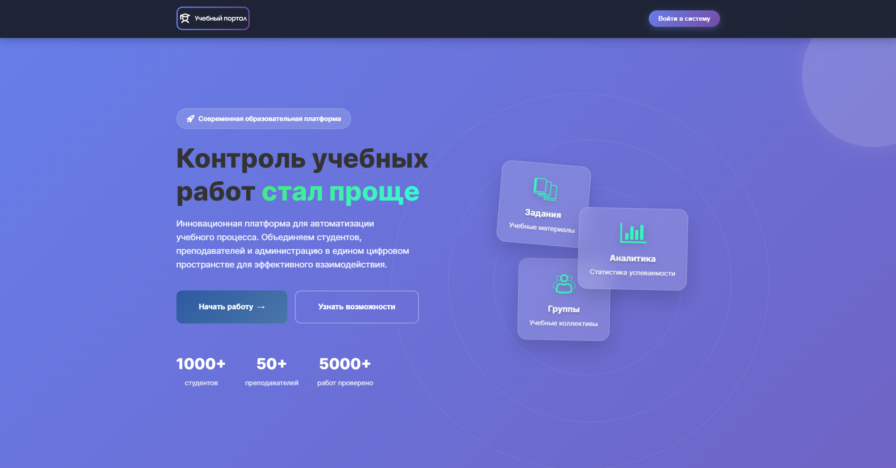
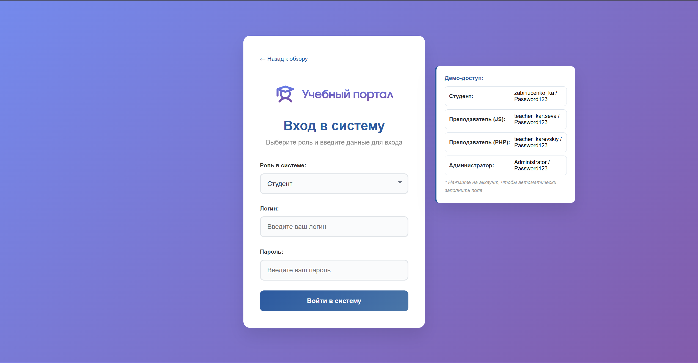
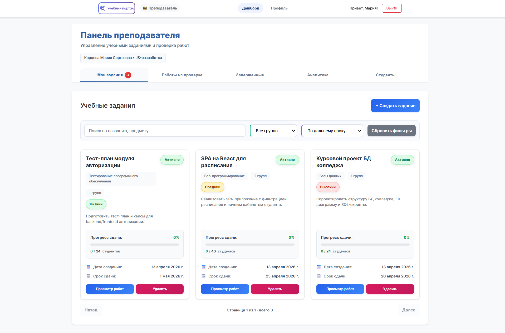
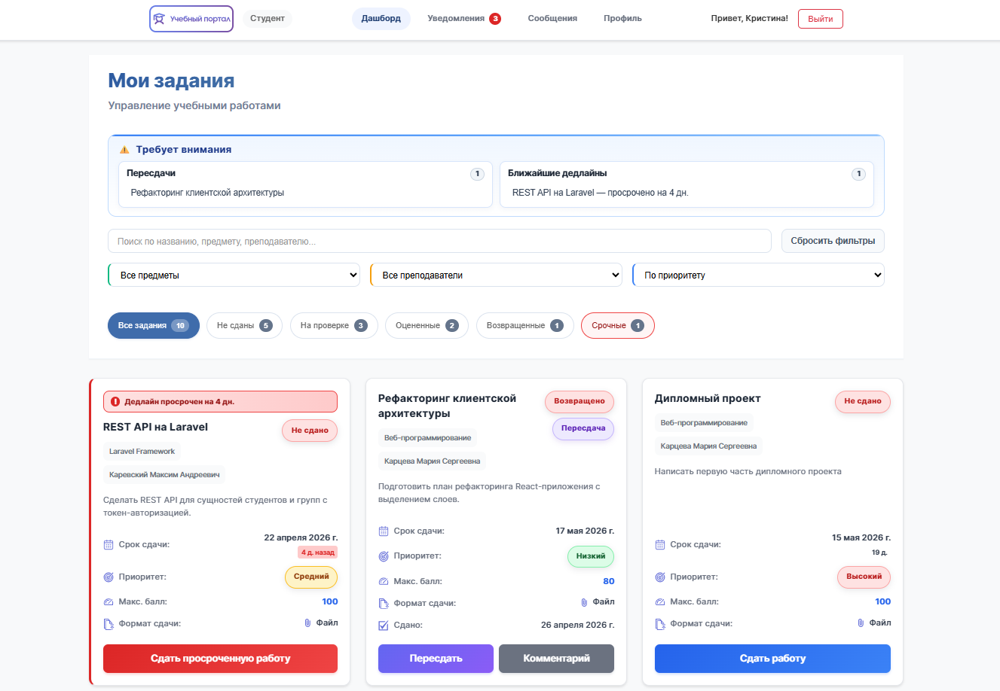
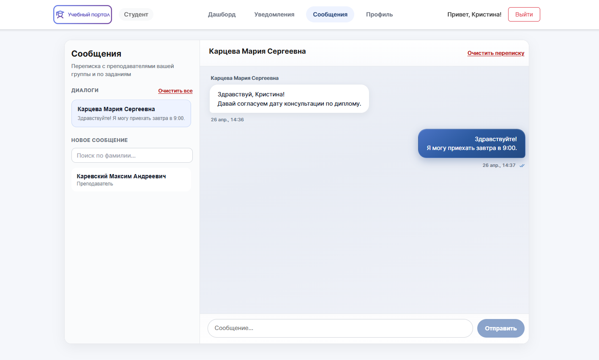
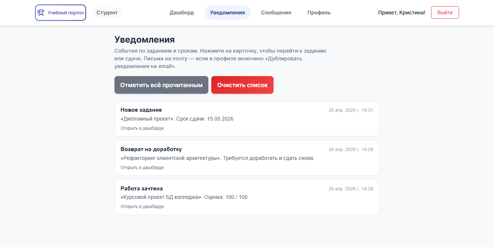
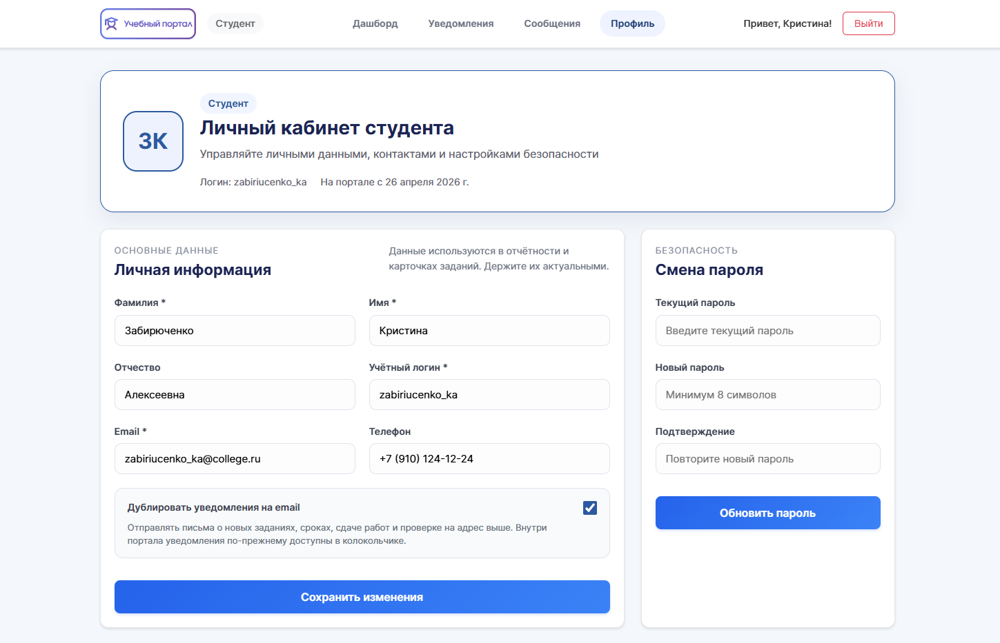
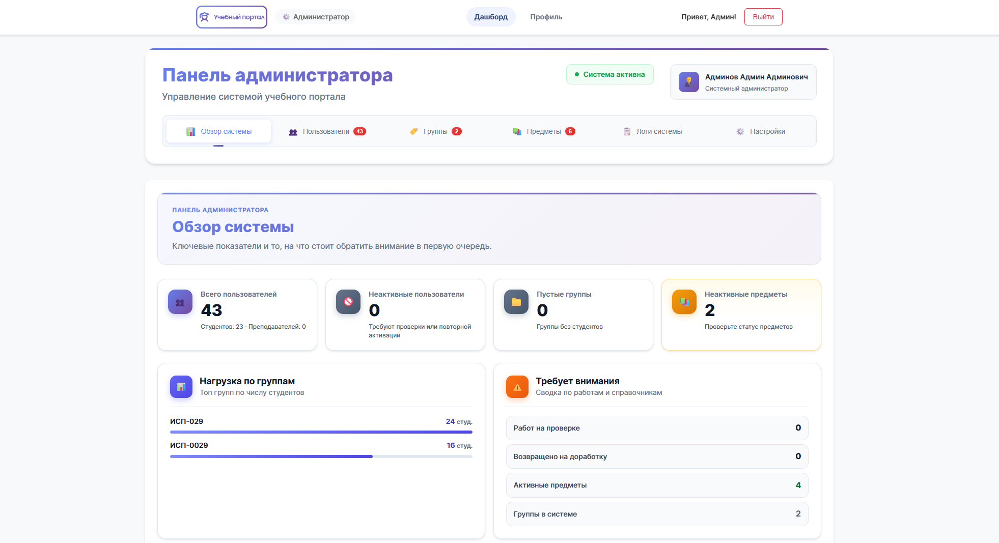
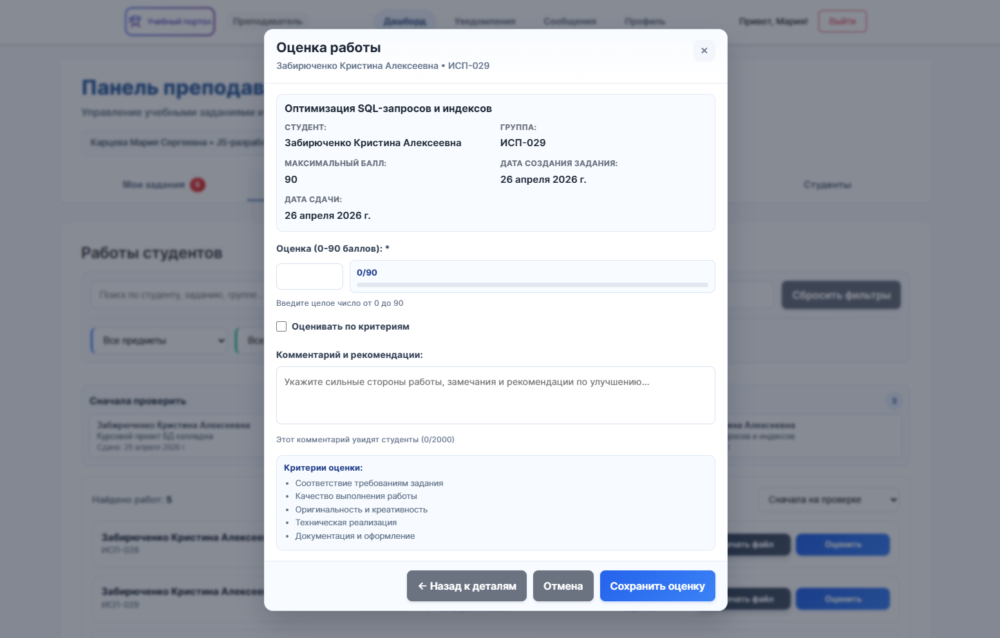

# 🎓 College Works Control  
### Современная платформа для управления учебными заданиями, проверкой работ и прозрачной коммуникацией между студентами, преподавателями и администрацией.


[](LICENSE)

---

## 📚 Оглавление

- [🎯 О проекте](#-о-проекте)
- [✅ Ключевые возможности](#-ключевые-возможности)
- [📸 Демонстрация](#-демонстрация)
- [🚀 Начало работы (Getting Started)](#-начало-работы-getting-started)
- [⚙️ Использование](#️-использование)
- [📦 Структура проекта](#-структура-проекта)
- [🛠️ Технологии](#️-технологии)
- [📄 Лицензия](#-лицензия)
- [👤 Автор](#-автор)

---

## 🎯 О проекте

**College Works Control** — это веб-система для управления учебными заданиями и проверкой работ в учебном процессе.  
Платформа объединяет три роли (студент, преподаватель, администратор) в едином интерфейсе и автоматизирует ключевые процессы: выдачу заданий, отправку решений, оценивание, переписку между студентом и преподавателем, уведомления и администрирование пользователей.  
Проект ориентирован на колледжи, кафедры и образовательные команды, которым важны прозрачность, контроль и удобство работы.

---

## ✅ Ключевые возможности

- ✅ **Ролевая модель доступа**: студент / преподаватель / администратор.
- 📦 **Управление заданиями**: создание, редактирование, удаление, прикрепление материалов.
- 🚀 **Отправка и проверка работ**: загрузка файлов, оценивание, возврат на доработку.
- 💬 **Сообщения**: переписка студент ↔ преподаватель, список диалогов и история сообщений.
- 🔔 **Уведомления**: список уведомлений, счётчик непрочитанных, отметка прочитанным.
- 👤 **Профиль**: данные пользователя, смена пароля (в т.ч. принудительная при первом входе).
- ⚙️ **Инструменты преподавателя**: просмотр студентов, рассылка сообщений группе (по API).
- ⚙️ **Админ-панель**: пользователи, группы, предметы, задания, системные логи, импорт.
- 🎨 **Современный интерфейс**: React, SCSS, адаптивная вёрстка и модальные окна.
- 📦 **API-first**: Laravel REST API + Sanctum, фронтенд на `axios`.

---

## 📸 Демонстрация

### 1) Главная страница (Welcome)

**Описание:** приветствие, кратко о платформе, кнопки входа по ролям.



---

### 2) Экран входа

**Описание:** логин, пароль, выбор роли, блок демо-доступа.



---

### 3) Дашборд преподавателя

**Описание:** список заданий, карточки, действия создания/редактирования, переход к сдачам.



---

### 4) Дашборд студента

**Описание:** список заданий со статусами, сдача работы, дедлайны.



---

### 5) Сообщения (переписка)

**Описание:** список собеседников/диалогов, область чата, отправка сообщения.



---

### 6) Уведомления

**Описание:** панель или выпадающий список уведомлений, непрочитанные, отметка прочитанным.



---

### 7) Профиль

**Описание:** редактирование профиля, смена пароля.



---

### 8) Админ-панель

**Описание:** пользователи, группы, предметы или сводная статистика.



---

### 9) Оценивание работы

**Описание:** модальное окно или форма: оценка, комментарий, возврат на доработку.



---

## 🚀 Начало работы (Getting Started)

### Требования

- `Node.js` (рекомендуется `20+`)
- `npm` (рекомендуется `10+`)
- `PHP` (`8.2+`)
- `Composer` (`2+`)
- `MySQL` (`8+`)
- Git

### Установка

```bash
git clone https://github.com/markup-dev/college-works-control.git
cd college-works-control
```

#### 1) Настройка backend (Laravel API)

```bash
cd backend
composer install
cp .env.example .env
php artisan key:generate
```

Отредактируйте параметры БД в `backend/.env`:

```env
DB_CONNECTION=mysql
DB_HOST=127.0.0.1
DB_PORT=3306
DB_DATABASE=college_works_control
DB_USERNAME=root
DB_PASSWORD=
```

Примените миграции и сиды:

```bash
php artisan migrate --seed
```

Запустите API:

```bash
php artisan serve
```

#### 2) Настройка frontend (React)

```bash
cd ../frontend
npm install
```

Создайте файл `.env` в `frontend`:

```env
REACT_APP_API_URL=http://localhost:8000/api
```

Запустите клиентское приложение:

```bash
npm start
```

<details>
<summary>🔍 Дополнительно: быстрый запуск в двух терминалах</summary>

```bash
# Терминал 1
cd backend
php artisan serve
```

```bash
# Терминал 2
cd frontend
npm start
```

После запуска:
- Frontend: `http://localhost:3000`
- Backend API: `http://localhost:8000/api`

</details>

---

## ⚙️ Использование

### Сценарий пользователя

1. Откройте главную или страницу входа.
2. Выберите роль (`student`, `teacher`, `admin`) и войдите.
3. В кабинете:
   - **студент** — задания, сдача работ, сообщения преподавателю, уведомления, профиль;
   - **преподаватель** — задания, проверка сдач, студенты, сообщения, рассылка, уведомления;
   - **администратор** — пользователи, группы, предметы, логи, статистика.

### Пример API-запроса (авторизация)

```bash
curl -X POST http://localhost:8000/api/login \
  -H "Content-Type: application/json" \
  -d "{\"login\":\"admin_sidorov\",\"password\":\"Password123\",\"role\":\"admin\"}"
```

---

## 📦 Структура проекта

```text
college-works-control/
├── backend/
│   ├── app/
│   │   ├── Http/Controllers/      # Auth, Assignment, Submission, Admin, Conversation, Notification, …
│   │   └── Models/
│   ├── database/
│   │   ├── migrations/
│   │   ├── seeders/
│   │   └── factories/
│   ├── routes/
│   │   └── api.php
│   └── tests/
│
├── frontend/
│   ├── src/
│   │   ├── components/
│   │   ├── context/
│   │   ├── pages/                 # Welcome, Login, дашборды, Profile, Messages, …
│   │   ├── services/
│   │   ├── styles/
│   │   └── utils/
│   └── public/
│
├── LICENSE
└── README.md
```

---

## 🛠️ Технологии

| Категория | Стек |
|---|---|
| Frontend 🎨 | `React` (Create React App, `react-scripts`), `React Router`, `Sass`, `Axios` |
| Backend ⚙️ | `Laravel 12`, `PHP 8.2+`, `Sanctum` |
| База данных 📦 | `MySQL` |
| Тестирование ✅ | `PHPUnit` — несколько feature-тестов в `backend/tests`. На frontend в зависимостях есть Jest и Testing Library (шаблон CRA); отдельные UI-тесты в репозитории не подключены |
| Инструменты 🚀 | `Composer`, `npm`, `php artisan`, `Git` |

---

## 📄 Лицензия

Проект распространяется по лицензии **MIT** — см. файл [`LICENSE`](LICENSE).

---

## 👤 Автор

- Кристина
