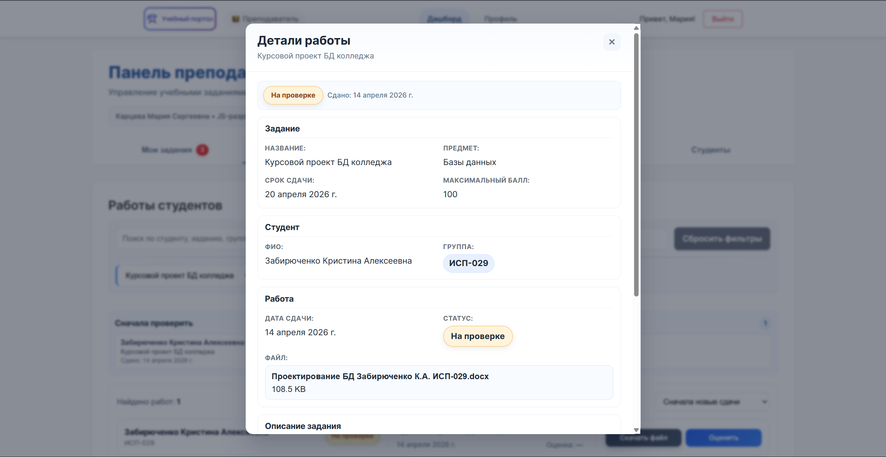
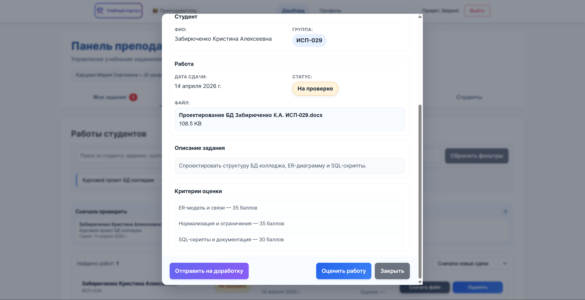

# 🎓 College Works Control  
### Современная платформа для управления учебными заданиями, проверкой работ и прозрачной коммуникацией между студентами, преподавателями и администрацией.


---

## 📚 Оглавление

- [🎯 О проекте](#-о-проекте)
- [✅ Ключевые возможности](#-ключевые-возможности)
- [📸 Демонстрация](#-демонстрация)
- [🚀 Начало работы (Getting Started)](#-начало-работы-getting-started)
- [⚙️ Использование](#️-использование)
- [📦 Структура проекта](#-структура-проекта)
- [🛠️ Технологии](#️-технологии)
- [📄 Лицензия и авторы](#-лицензия-и-авторы)

---

## 🎯 О проекте

**College Works Control** — это веб-система для управления учебными заданиями и проверкой работ в учебном процессе.  
Платформа объединяет три роли (студент, преподаватель, администратор) в едином интерфейсе и автоматизирует ключевые процессы: выдачу заданий, отправку решений, оценивание и администрирование пользователей.  
Проект ориентирован на колледжи, кафедры и образовательные команды, которым важны прозрачность, контроль и удобство работы.

---

## ✅ Ключевые возможности

- ✅ **Ролевая модель доступа**: студент / преподаватель / администратор.
- 📦 **Управление заданиями**: создание, редактирование, удаление, прикрепление материалов.
- 🚀 **Отправка и проверка работ**: загрузка файлов, оценивание, возврат на доработку.
- ⚙️ **Админ-панель**: управление пользователями, группами, предметами и системными логами.
- 🎨 **Современный интерфейс**: адаптивные React-компоненты и удобные модальные окна.
- ✅ **Импорт данных**: массовая загрузка пользователей, групп и предметов.
- 📦 **API-first архитектура**: фронтенд и бэкенд разделены и масштабируются независимо.

---

## 📸 Демонстрация

### 1) Главная страница

**Описание скриншота:**  
На главной странице отображается приветственное сообщение, краткое описание платформы и основные навигационные элементы. Пользователь может выбрать роль для входа, ознакомиться с функционалом и перейти к началу работы.


### 2) Экран входа и выбор роли

**Описание скриншота:** форма авторизации с выбором роли (студент / преподаватель / администратор), полями логина и пароля.


---

### 3) Дашборд преподавателя с заданиями

**Описание скриншота:** список заданий преподавателя, действия создания/редактирования, быстрый переход к проверке работ.


---

### 4) Админ-панель: пользователи, группы, предметы

**Описание скриншота:** административный модуль с таблицами управления пользователями, группами и предметами.


---

### 5) Проверка и оценивание отправленной работы

**Описание скриншота:** окно просмотра отправки, выставление оценки и комментария преподавателя.





---

## 🚀 Начало работы (Getting Started)

### Требования

- `Node.js` (рекомендуется `20+`)
- `npm` (рекомендуется `10+`)
- `PHP` (`8.2+`)
- `Composer` (`2+`)
- `MySQL` (`8+`)
- Git

### Установка

```bash
git clone https://github.com/markup-dev/college-works-control.git
cd college-works-control
```

#### 1) Настройка backend (Laravel API)

```bash
cd backend
composer install
cp .env.example .env
php artisan key:generate
```

Отредактируйте параметры БД в `backend/.env`:

```env
DB_CONNECTION=mysql
DB_HOST=127.0.0.1
DB_PORT=3306
DB_DATABASE=college_works_control
DB_USERNAME=root
DB_PASSWORD=
```

Примените миграции и сиды:

```bash
php artisan migrate --seed
```

Запустите API:

```bash
php artisan serve
```

#### 2) Настройка frontend (React)

```bash
cd ../frontend
npm install
```

Создайте файл `.env` в `frontend`:

```env
REACT_APP_API_URL=http://localhost:8000/api
```

Запустите клиентское приложение:

```bash
npm start
```

<details>
<summary>🔍 Дополнительно: быстрый запуск в двух терминалах</summary>

```bash
# Терминал 1
cd backend
php artisan serve
```

```bash
# Терминал 2
cd frontend
npm start
```

После запуска:
- Frontend: `http://localhost:3000`
- Backend API: `http://localhost:8000/api`

</details>

---

## ⚙️ Использование

### Сценарий пользователя

1. Откройте страницу входа.
2. Выберите роль (`student`, `teacher`, `admin`).
3. Выполните вход с вашими учетными данными.
4. Работайте в соответствующем дашборде:
   - студент: просмотр заданий, отправка работ;
   - преподаватель: создание заданий, проверка и оценивание;
   - администратор: управление пользователями, группами, предметами, логами.

### Пример API-запроса (авторизация)

```bash
curl -X POST http://localhost:8000/api/login \
  -H "Content-Type: application/json" \
  -d "{\"login\":\"admin_sidorov\",\"password\":\"Password123\",\"role\":\"admin\"}"
```

---

## 📦 Структура проекта

```text
college-works-control/
├── backend/
│   ├── app/
│   │   ├── Http/Controllers/      # Контроллеры API (Auth, Assignment, Submission, Admin)
│   │   └── Models/                # Модели домена
│   ├── database/
│   │   ├── migrations/            # Миграции схемы БД
│   │   ├── seeders/               # Тестовые/начальные данные
│   │   └── factories/             # Фабрики данных
│   ├── routes/
│   │   └── api.php                # Маршруты REST API
│   └── tests/                     # Feature/Unit тесты
│
├── frontend/
│   ├── src/
│   │   ├── components/            # UI-компоненты по ролям и общие модули
│   │   ├── context/               # Контексты состояния (Auth, Admin, Teacher, Student)
│   │   ├── pages/                 # Страницы приложения
│   │   ├── services/              # API-клиенты и сервисный слой
│   │   ├── styles/                # SCSS-стили и базовые токены
│   │   └── utils/                 # Валидация и вспомогательные функции
│   └── public/
│
└── README.md
```

---

## 🛠️ Технологии

| Категория | Стек |
|---|---|
| Frontend 🎨 | `React`, `React Router`, `Sass`, `Axios` |
| Backend ⚙️ | `Laravel 12`, `PHP 8.2+`, `Sanctum` |
| База данных 📦 | `MySQL` |
| Тестирование ✅ | `PHPUnit`, `Testing Library` |
| Инструменты 🚀 | `Composer`, `npm`, `Vite` (в backend toolchain), `Git` |

---

## 📄 Лицензия и авторы

**Лицензия:** `MIT`  
Подробности в файле `LICENSE`.

**Авторы:**
- 👤 Кристина.
