# 🎓 College Works Control  
### Современная платформа для управления учебными заданиями, проверкой работ и прозрачной коммуникацией между студентами, преподавателями и администрацией.


[](LICENSE)

---

## 📚 Оглавление

- [🎯 О проекте](#-о-проекте)
- [✅ Ключевые возможности](#-ключевые-возможности)
- [📸 Демонстрация](#-демонстрация)
- [🚀 Начало работы (Getting Started)](#-начало-работы-getting-started)
- [⚙️ Использование](#️-использование)
- [📦 Структура проекта](#-структура-проекта)
- [🛠️ Технологии](#️-технологии)
- [📄 Лицензия](#-лицензия)
- [👤 Автор](#-автор)

---

## 🎯 О проекте

**College Works Control** — веб-система для управления учебными заданиями и проверкой работ в учебном процессе колледжа.

Платформа объединяет три роли (студент, преподаватель, администратор) в едином интерфейсе и автоматизирует ключевые процессы: учебные программы и специальности, назначение преподавателей на группы и дисциплины, выдачу заданий, отправку и проверку работ, переписку, уведомления, рассылки и администрирование пользователей.

Проект ориентирован на колледжи, кафедры и образовательные команды, которым важны прозрачность, контроль и удобство работы.

---

## ✅ Ключевые возможности

### Общие

- ✅ **Ролевая модель**: студент / преподаватель / администратор с разграничением API и UI.
- 🔔 **Уведомления**: список, счётчик непрочитанных, массовая отметка и очистка.
- 👤 **Профиль**: данные пользователя, смена пароля (включая принудительную при первом входе).
- 📢 **Платформенный баннер**: глобальное сообщение для аудитории (настраивается администратором).
- 🎨 **Интерфейс**: React, SCSS, адаптивная вёрстка, модальные окна, toast-уведомления.

### Студент

- 📋 **Задания**: список с фильтрами, статусы, дедлайны, блок «требует внимания» (пересдачи и сроки).
- 📤 **Сдача работ**: загрузка файла или отметка «готов к демонстрации»; поддержка chunk-upload для больших файлов.
- 📎 **Материалы заданий**: скачивание материалов преподавателя.
- 💬 **Сообщения**: переписка с преподавателем, архивация диалогов.
- 📊 **Результаты**: оценки, комментарии, история сдач.

### Преподаватель

- 📦 **Задания**: создание, редактирование, критерии оценки, материалы, форматы файлов, тип сдачи (файл / демонстрация).
- 🗂️ **Банк заданий**: заготовки для повторной выдачи группам без копирования вручную.
- 🚀 **Проверка работ**: оценка, комментарий, возврат на доработку, очередь сдач с фильтрами.
- 📈 **Аналитика**: успеваемость, активность, статистика по группам и периодам.
- 👥 **Группы и студенты**: обзор групп, карточки студентов, рассылка личных сообщений группе.
- 📚 **Дисциплины**: список назначенных дисциплин, заявки на допуск к дисциплине и назначение на группу (с документами).
- 💬 **Сообщения и рассылка**: переписка со студентами, напоминания о несданных работах.

### Администратор

- 📊 **Дашборд**: сводная статистика, график активности за неделю, последние события журнала.
- 👤 **Пользователи**: CRUD, сброс учётных данных, предупреждения, импорт из CSV.
- 🏫 **Группы**: CRUD, перевод курса, массовое добавление студентов, импорт CSV, карточка группы.
- 🎓 **Специальности**: учебные программы, синхронизация дисциплин по курсам.
- 📖 **Дисциплины**: CRUD, импорт CSV, допуски преподавателей к дисциплинам.
- 📌 **Назначения (teaching loads)**: кто ведёт дисциплину в группе; пакетное создание, перенос, модерация заявок преподавателей.
- 📝 **Задания (homework)**: обзор всех заданий в системе, смена преподавателя, фильтры.
- 📣 **Рассылки**: массовые уведомления пользователям.
- 📜 **Журнал**: системные логи с фильтрами и экспорт в CSV.
- ⚙️ **Настройки**: баннер, политика паролей, шаблон письма с учётными данными, параметры безопасности.

### Backend

- 📦 **API-first**: Laravel REST API + Sanctum, rate limiting, signed URLs для материалов.
- ✅ **Тесты**: набор PHPUnit feature-тестов (задания, сдачи, уведомления, заявки преподавателей и др.).

---

## 📸 Демонстрация

### 1) Главная страница (Welcome)

**Описание:** приветствие, блоки возможностей, выбор роли для входа.

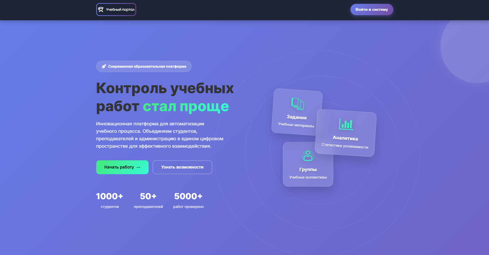

---

### 2) Экран входа

**Описание:** логин, пароль, выбор роли, быстрый вход по демо-аккаунтам.

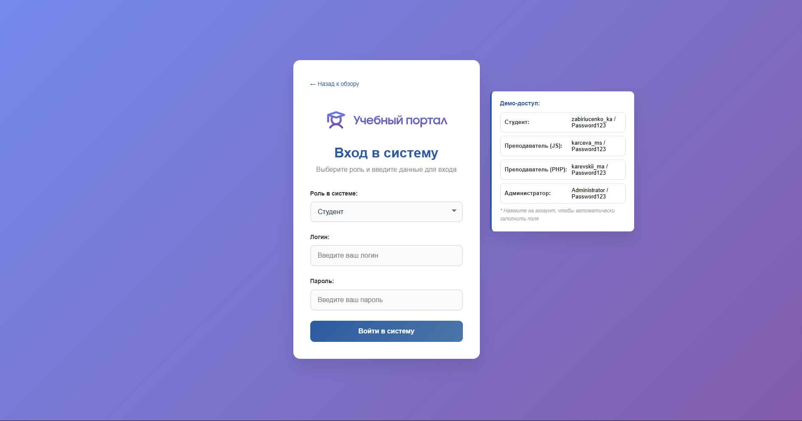

---

### 3) Дашборд преподавателя — задания

**Описание:** список активных заданий, карточки, создание и редактирование.

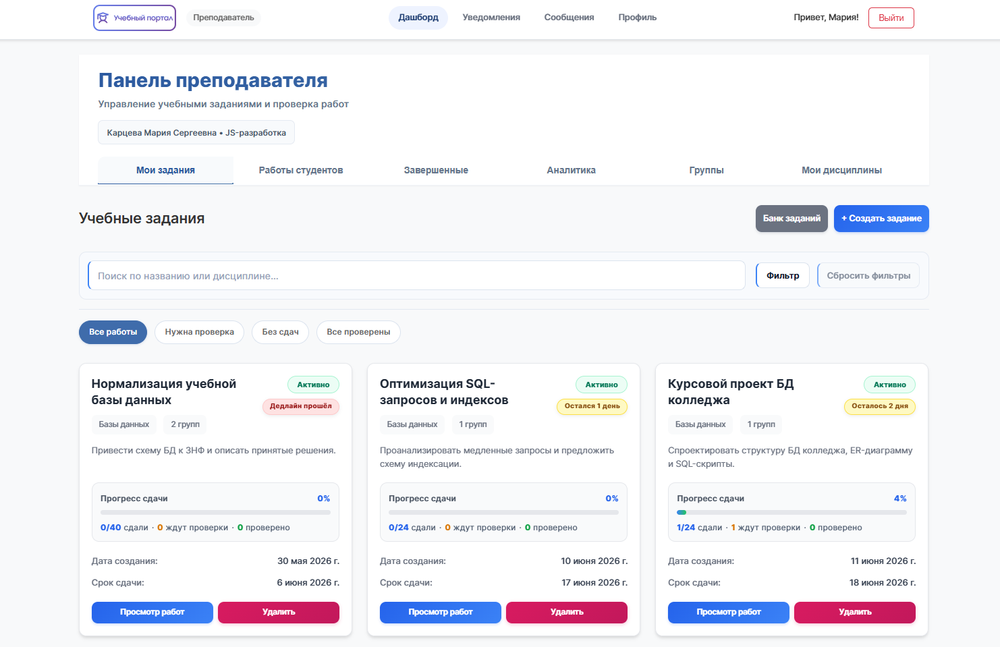

---

### 4) Дашборд преподавателя — проверка работ

**Описание:** очередь сдач, фильтры по статусу, группе и дисциплине.

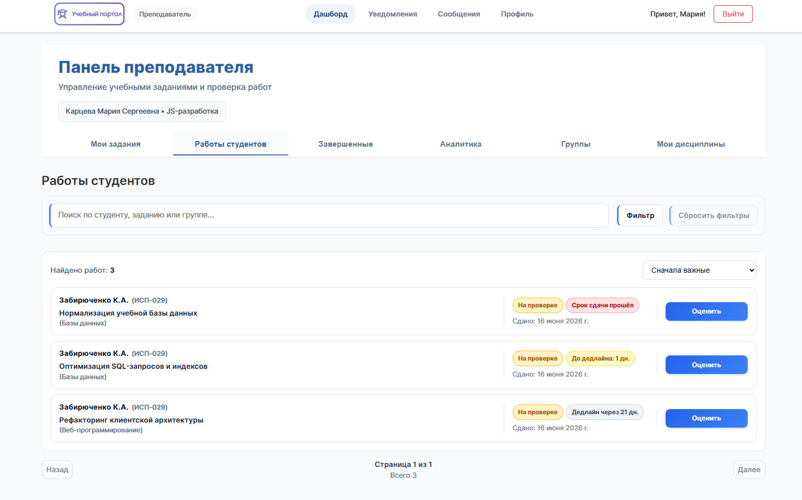

---

### 5) Дашборд преподавателя — аналитика

**Описание:** статистика успеваемости и активности по группам и периодам.

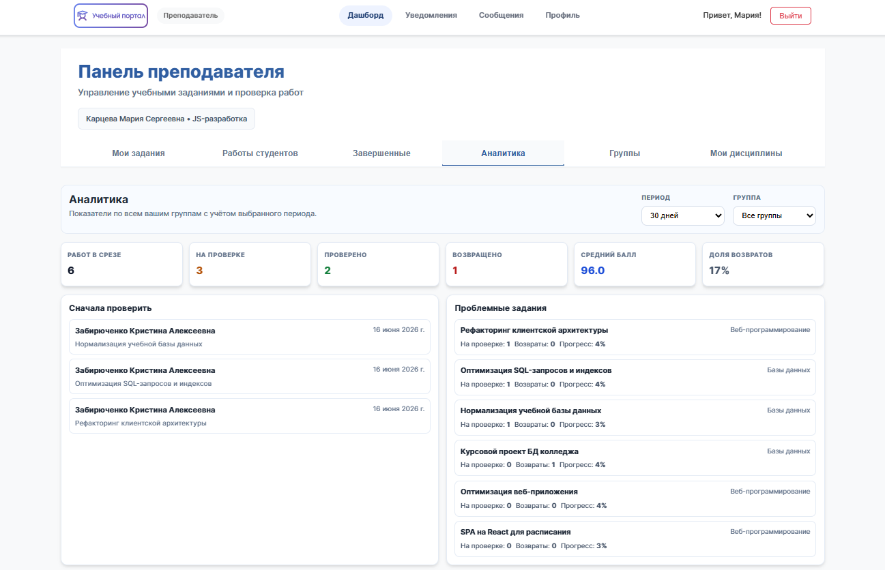

---

### 6) Банк заданий

**Описание:** заготовки заданий, выдача группе из банка, редактирование шаблонов.

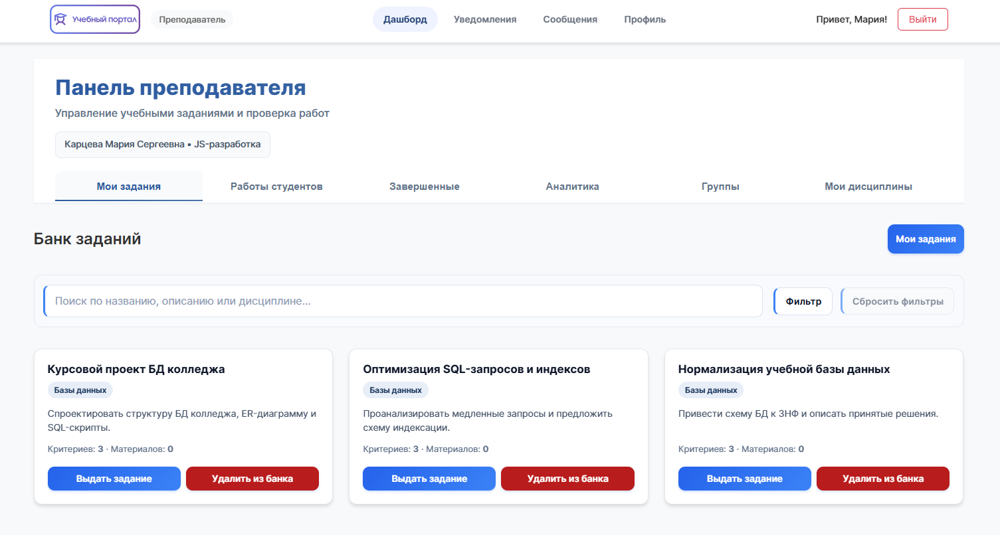

---

### 7) Дашборд студента

**Описание:** список заданий со статусами, фильтры, блок «требует внимания», сдача работы.

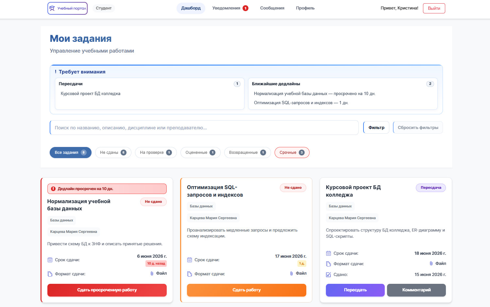

---

### 8) Сообщения (переписка)

**Описание:** список диалогов, чат, архивация.

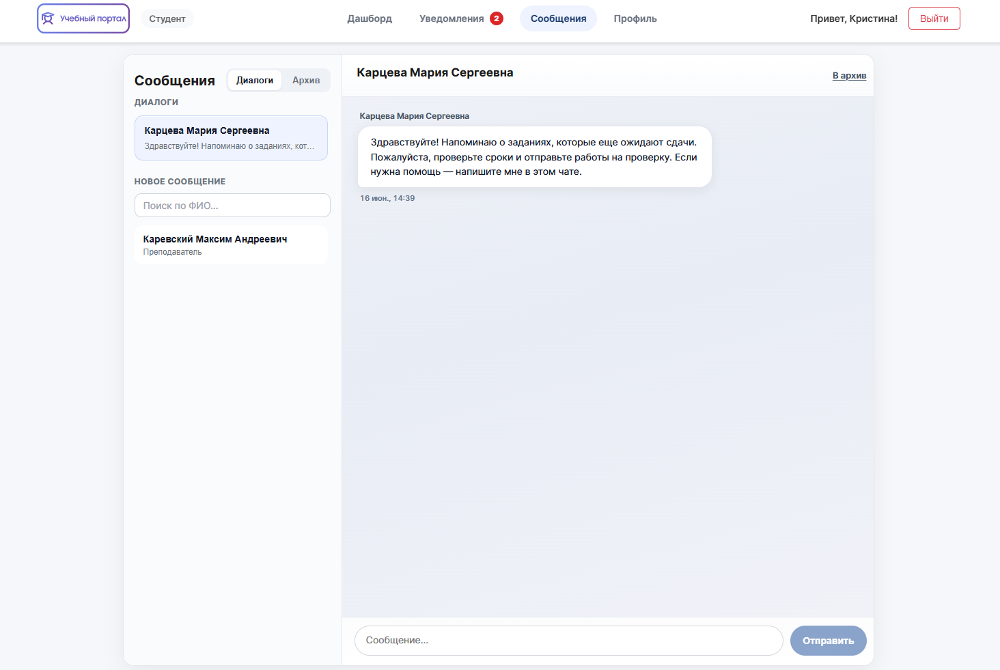

---

### 9) Уведомления

**Описание:** список уведомлений, непрочитанные, отметка прочитанным.

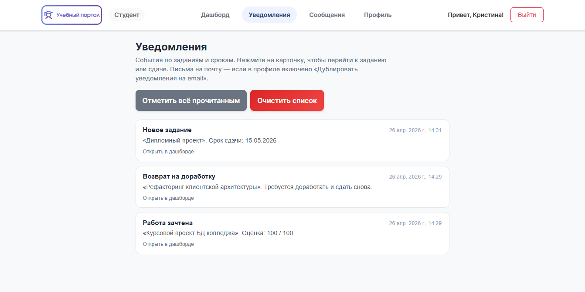

---

### 10) Профиль

**Описание:** редактирование данных, смена пароля.

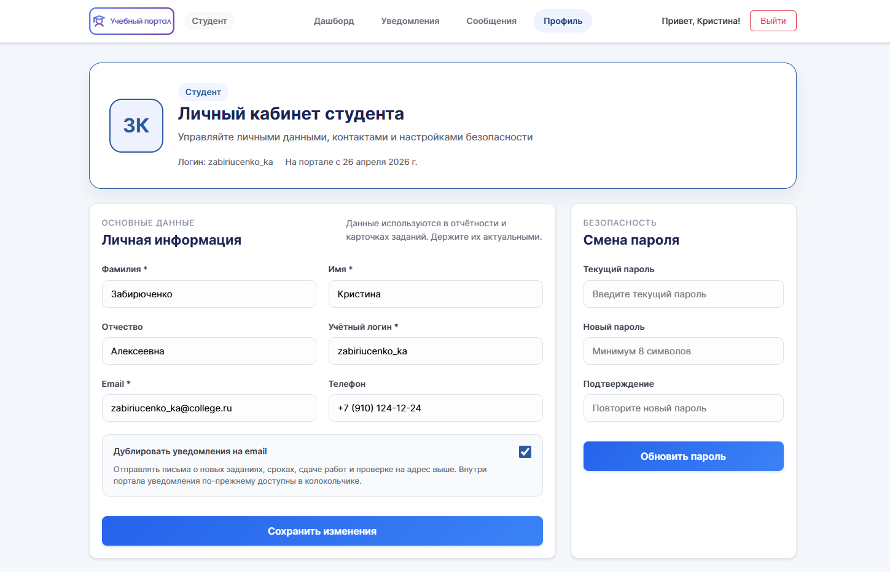

---

### 11) Оценивание работы

**Описание:** модальное окно: оценка, комментарий, возврат на доработку.

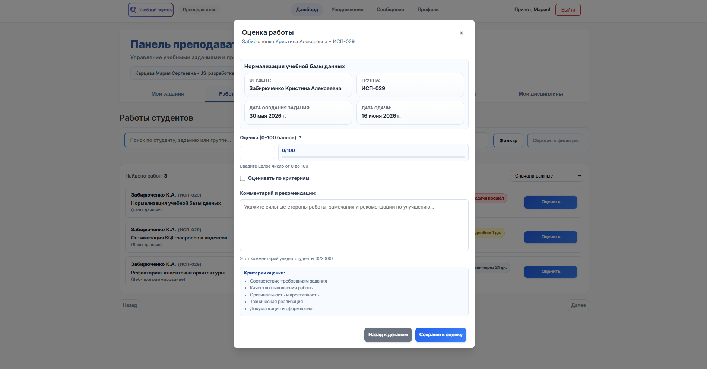

---

### 12) Админ-панель — дашборд

**Описание:** сводная статистика, график активности, быстрые ссылки.

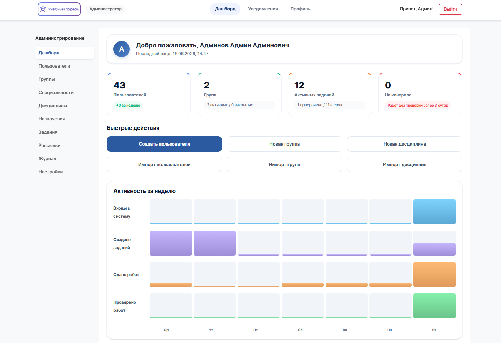

---

### 13) Админ-панель — пользователи и группы

**Описание:** управление пользователями, группами, импорт.

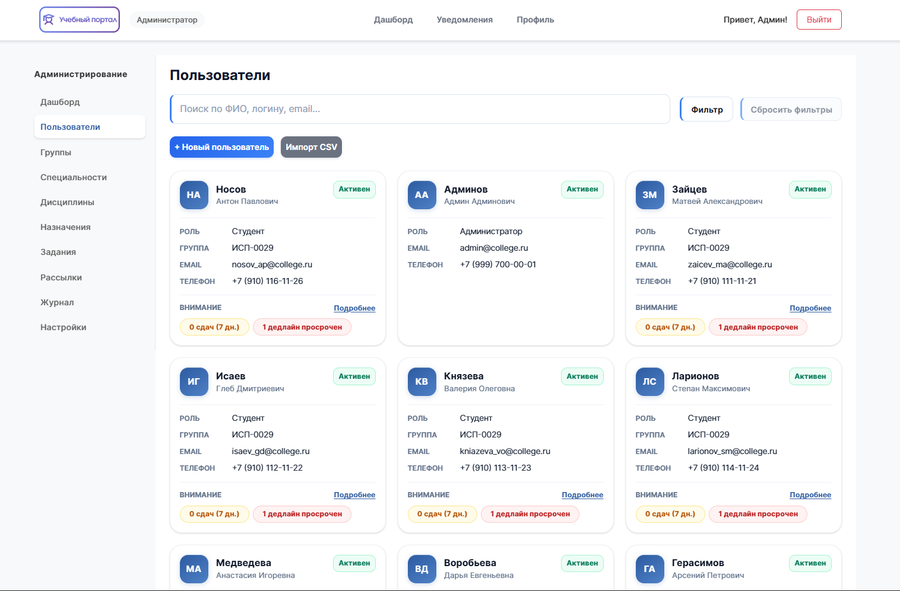

---

### 14) Админ-панель — специальности и учебные программы

**Описание:** специальности, дисциплины по курсам, синхронизация программы.

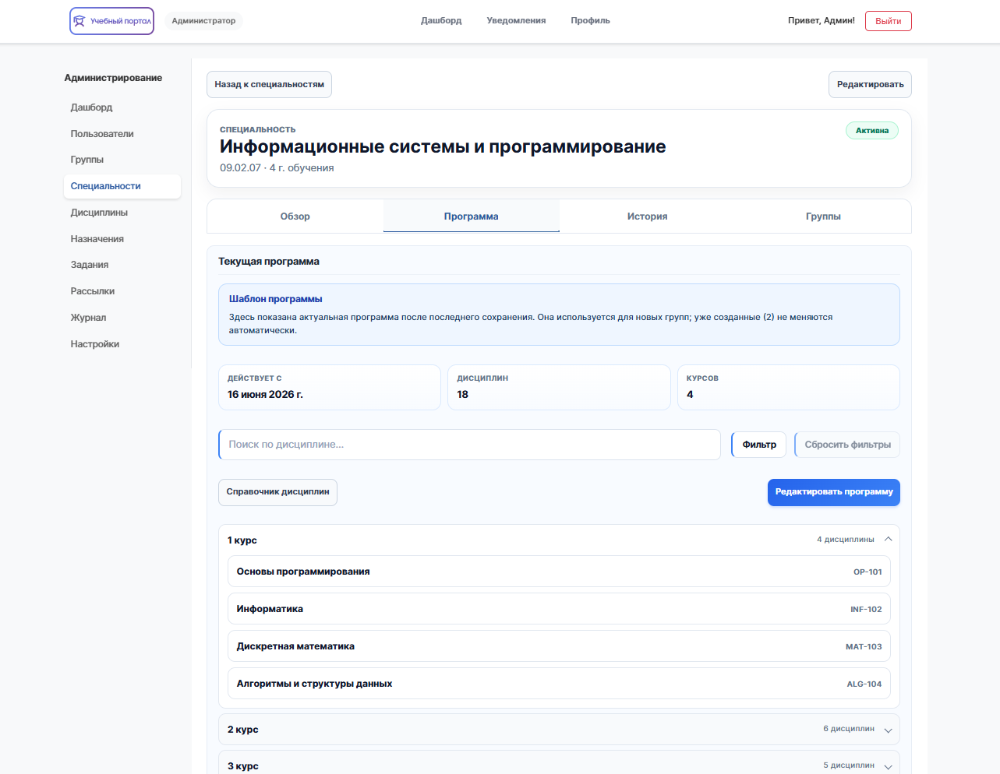

---

### 15) Админ-панель — назначения преподавателей

**Описание:** teaching loads, заявки преподавателей, модерация.

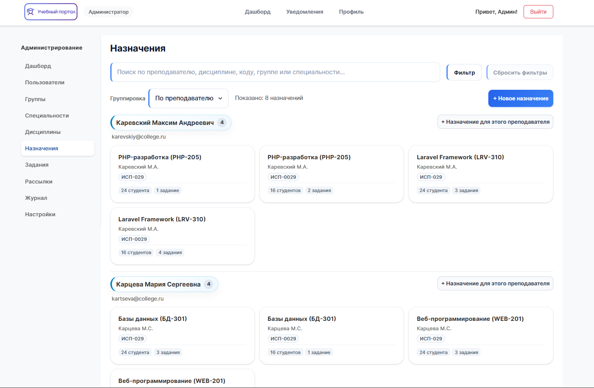

---

### 16) Админ-панель — настройки и рассылки

**Описание:** системные настройки, баннер, рассылки.

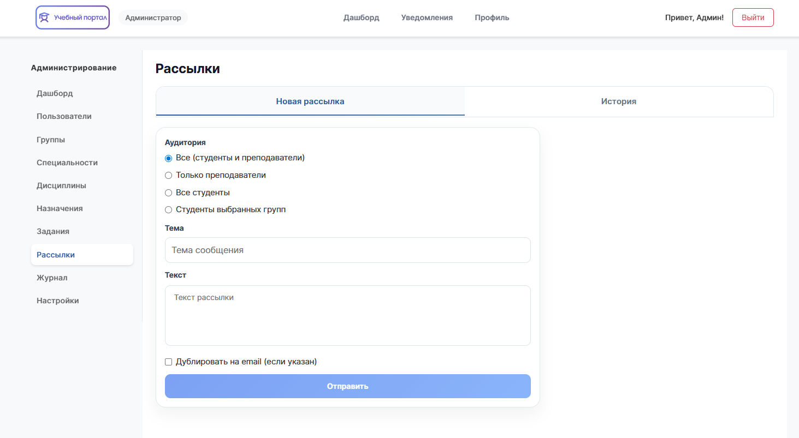

---

## 🚀 Начало работы (Getting Started)

### Требования

- `Node.js` (рекомендуется `20+`)
- `npm` (рекомендуется `10+`)
- `PHP` (`8.2+`)
- `Composer` (`2+`)
- `MySQL` (`8+`)
- Git

### Установка

```bash
git clone https://github.com/markup-dev/college-works-control.git
cd college-works-control
```

#### 1) Настройка backend (Laravel API)

```bash
cd backend
composer install
cp .env.example .env
php artisan key:generate
```

Отредактируйте параметры БД в `backend/.env`:

```env
DB_CONNECTION=mysql
DB_HOST=127.0.0.1
DB_PORT=3306
DB_DATABASE=college_works_control
DB_USERNAME=root
DB_PASSWORD=
```

Примените миграции и сиды (демо-пользователи, группы, дисциплины, задания):

```bash
php artisan migrate --seed
```

Запустите API:

```bash
php artisan serve
```

На Windows можно запустить `serve.bat` в папке `backend`.

#### 2) Настройка frontend (React)

```bash
cd ../frontend
npm install
```

Создайте файл `.env` в `frontend`:

```env
REACT_APP_API_URL=http://localhost:8000/api
```

Запустите клиентское приложение:

```bash
npm start
```

<details>
<summary>🔍 Дополнительно: быстрый запуск в двух терминалах</summary>

```bash
# Терминал 1
cd backend
php artisan serve
```

```bash
# Терминал 2
cd frontend
npm start
```

После запуска:
- Frontend: `http://localhost:3000`
- Backend API: `http://localhost:8000/api`

</details>

<details>
<summary>🔍 Дополнительно: сборка frontend для деплоя</summary>

```bash
cd frontend
npm run build
```

Скрипт `npm run deploy` собирает проект и выкладывает `build/` через `gh-pages` (требует настройки репозитория).

</details>

---

## ⚙️ Использование

### Демо-аккаунты (после `migrate --seed`)

Пароль для всех демо-учёток: `Password123`

| Роль | Логин | Описание |
|------|-------|----------|
| Студент | `zabiriucenko_ka` | группа ИСП-029 |
| Преподаватель (JS) | `karceva_ms` | отдел JS-разработки |
| Преподаватель (PHP) | `karevskii_ma` | отдел PHP-разработки |
| Администратор | `Administrator` | полный доступ |

На странице входа демо-аккаунты можно выбрать одним кликом.

### Сценарий пользователя

1. Откройте главную (`/welcome`) или страницу входа (`/login`).
2. Выберите роль и войдите (или используйте демо-аккаунт).
3. В кабинете:
   - **студент** (`/student`) — задания, сдача работ, сообщения, уведомления, профиль;
   - **преподаватель** (`/teacher`) — задания, банк заданий, проверка сдач, аналитика, группы, дисциплины, сообщения;
   - **администратор** (`/admin/dashboard`) — дашборд, пользователи, группы, специальности, дисциплины, назначения, задания, рассылки, журнал, настройки.

### Пример API-запроса (авторизация)

```bash
curl -X POST http://localhost:8000/api/login \
  -H "Content-Type: application/json" \
  -d "{\"login\":\"Administrator\",\"password\":\"Password123\",\"role\":\"admin\"}"
```

Ответ содержит токен Sanctum — передавайте его в заголовке `Authorization: Bearer <token>` для защищённых эндпоинтов.

### Запуск тестов backend

```bash
cd backend
php artisan test
```

---

## 📦 Структура проекта

```text
college-works-control/
├── backend/
│   ├── app/
│   │   ├── Http/Controllers/       # API: Auth, Assignment, Submission, Admin, …
│   │   ├── Models/
│   │   ├── Notifications/
│   │   ├── Services/               # Assignment, Submission, Import, AcademicProgram, …
│   │   └── Support/
│   ├── database/
│   │   ├── migrations/
│   │   ├── seeders/                # UserSeeder, AssignmentSeeder, …
│   │   └── factories/
│   ├── routes/
│   │   └── api.php
│   ├── tests/Feature/              # PHPUnit feature-тесты
│   └── serve.bat
│
├── frontend/
│   ├── src/
│   │   ├── components/
│   │   │   ├── Admin/              # админ-панель
│   │   │   ├── Teacher/            # кабинет преподавателя
│   │   │   ├── Student/            # кабинет студента
│   │   │   ├── Shared/             # общие модалки и виджеты
│   │   │   ├── Layout/             # Header, Footer
│   │   │   └── UI/                 # Button, Modal, Pagination, …
│   │   ├── context/                # Auth, Teacher, Student, Admin, Notification
│   │   ├── pages/                  # Welcome, Login, дашборды, Profile, Messages, …
│   │   ├── services/               # api, authService
│   │   ├── config/                 # adminNavItems, teacherDashboardNavItems
│   │   ├── hooks/
│   │   ├── utils/
│   │   └── styles/
│   └── public/
│
├── screenshots/                    # скриншоты для README
├── LICENSE
└── README.md
```

---

## 🛠️ Технологии

| Категория | Стек |
|---|---|
| Frontend 🎨 | `React 19`, Create React App (`react-scripts`), `React Router 7`, `Sass`, `Axios` |
| Backend ⚙️ | `Laravel 12`, `PHP 8.2+`, `Sanctum` |
| База данных 📦 | `MySQL` |
| Тестирование ✅ | `PHPUnit 11` — feature-тесты в `backend/tests/Feature`; на frontend в зависимостях Jest и Testing Library (шаблон CRA) |
| Инструменты 🚀 | `Composer`, `npm`, `php artisan`, `Git`, `gh-pages` (опциональный деплой) |

---

## 📄 Лицензия

Проект распространяется по лицензии **MIT** — см. файл [`LICENSE`](LICENSE).

---

## 👤 Автор

- Кристина
